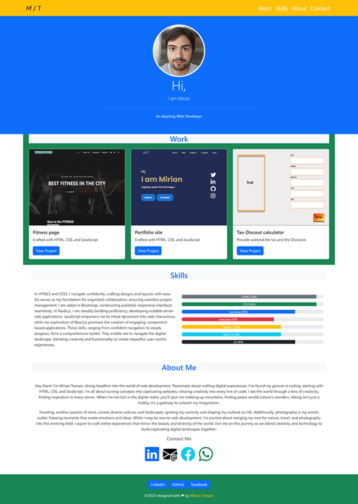
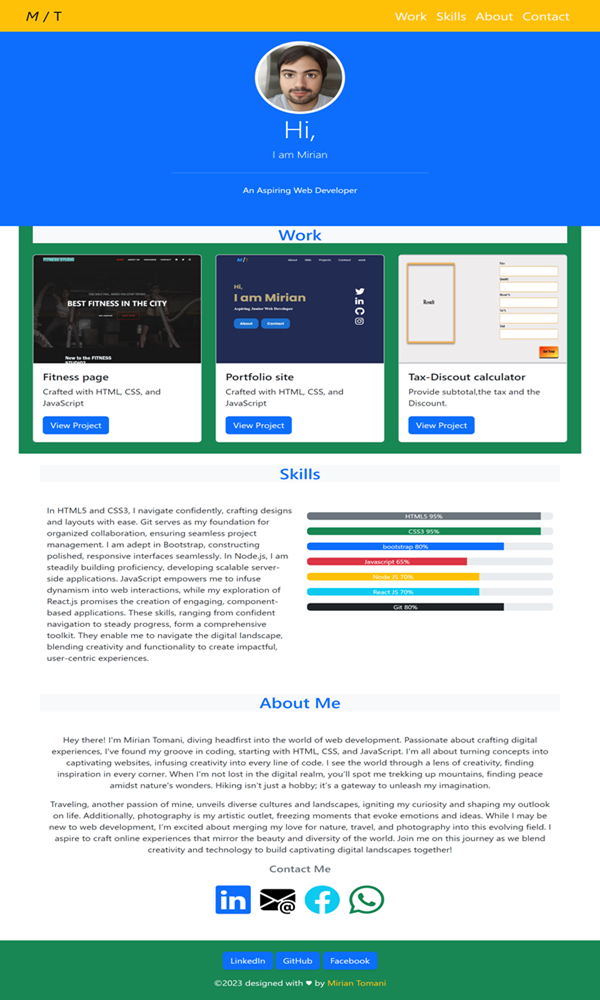

# Bootstrap-Portfolio
Explore Bootstrap-Portfolio, a testament to my Bootstrap journey, elevating my skills in crafting responsive web experiences. 
Here, I've refined my expertise, seamlessly integrating Bootstrap's power to create fluid, adaptable designs. 

## Key Features

### Responsive Design 
• Utilizes Bootstrap classes for a responsive and mobile-friendly layout across various devices.

### Navigation 
• Implements a fixed-top navbar with smooth scrolling functionality to navigate different sections.

### Project Showcase
• Showcases multiple projects with images and details in a card-based layout for easy access and exploration.

### Skill Representation
• Demonstrates skill levels using progress bars for a visual representation of proficiency.

### Contact Information 
• Offers multiple social media links for networking and easy communication.

## Installation

Upload index.html, license.txt, images and CSS folders to the deployed webserver.

The deployed website linked was deployed using GitHub Pages.
[Link to the deployed website](https://john-991.github.io/Bootstrap-Portfolio/)

## Usage 

It it optimized for smaller screens.
[html link](index.html)

### Desktop Version

### Tablet Version

### Mobile Version

## Credits

Collaborators on this project included staff, TAs, and students in the EDX Boot Camp 2023 cohort. 

## License

Copyright (c) 2023 John-991

Permission is hereby granted, free of charge, to any person obtaining a copy
of this software and associated documentation files (the "Software"), to deal
in the Software without restriction, including without limitation the rights
to use, copy, modify, merge, publish, distribute, sublicense, and/or sell
copies of the Software, and to permit persons to whom the Software is
furnished to do so, subject to the following conditions:

The above copyright notice and this permission notice shall be included in all
copies or substantial portions of the Software.

THE SOFTWARE IS PROVIDED "AS IS", WITHOUT WARRANTY OF ANY KIND, EXPRESS OR
IMPLIED, INCLUDING BUT NOT LIMITED TO THE WARRANTIES OF MERCHANTABILITY,
FITNESS FOR A PARTICULAR PURPOSE AND NONINFRINGEMENT. IN NO EVENT SHALL THE
AUTHORS OR COPYRIGHT HOLDERS BE LIABLE FOR ANY CLAIM, DAMAGES OR OTHER
LIABILITY, WHETHER IN AN ACTION OF CONTRACT, TORT OR OTHERWISE, ARISING FROM,
OUT OF OR IN CONNECTION WITH THE SOFTWARE OR THE USE OR OTHER DEALINGS IN THE
SOFTWARE.
